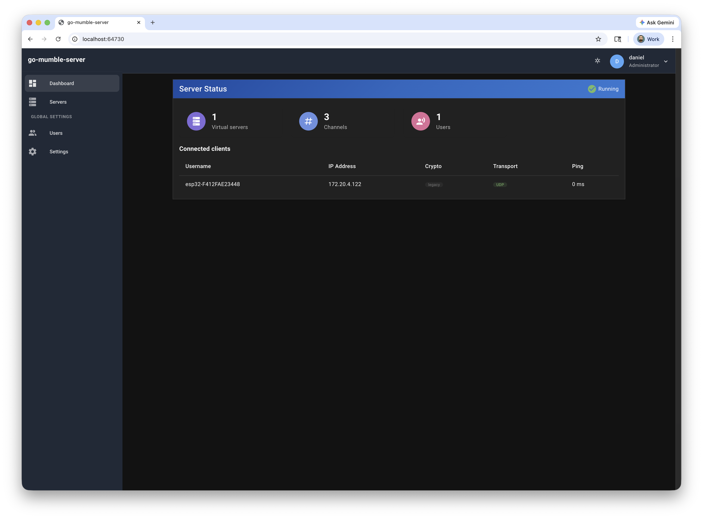
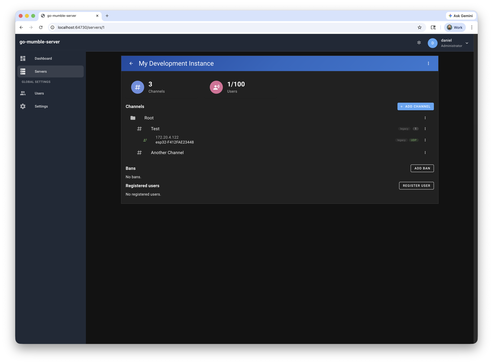
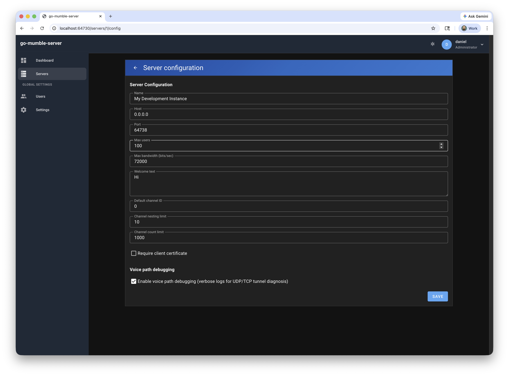
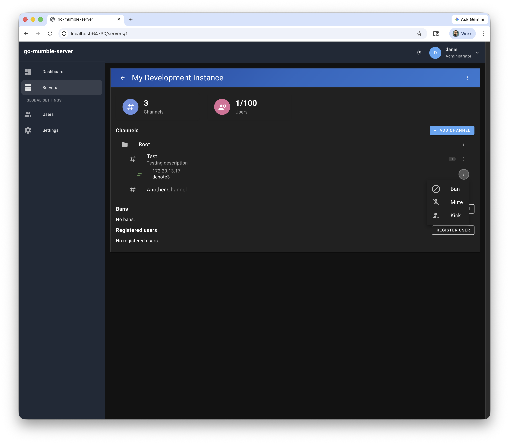

# go-mumble-server

A modern, from-scratch implementation of the [Mumble](https://www.mumble.info/) voice chat server written in Go. Wire-compatible with all standard Mumble clients — drop-in replacement for the original Murmur server.

The Mumble protocol implementation is a **reusable Go library** (`pkg/mumble/`) that can be imported independently to build clients, bots, bridges, or other tools.

**Status: Beta** — Functionally complete; ready for v0.1 release. [Releases](https://github.com/dchote/go-mumble-server/releases) provide Linux amd64/arm64 binaries and .deb packages.

## Overview

go-mumble-server re-imagines the Mumble server with modern priorities: a single static binary, zero runtime dependencies, built-in REST management API, and Go's straightforward concurrency model replacing the original's C++/Qt complexity.

**Mumble protocol on TCP/TLS :64738** — Full control channel with native Go message encoding (no protobuf).
**Voice on UDP :64738** — Low-latency AEAD-encrypted audio with TCP tunnel fallback.
**REST management API on :64730** — Administration and monitoring with Swagger docs at `/docs`.
**Web management UI** — Vue 3 + Vuetify frontend embedded in the binary, served alongside the REST API.

**Per-client security negotiation** — Legacy (default), secure, or lite. Standard Mumble clients use legacy automatically; secure-aware clients upgrade when possible. Mixed-mode channels (e.g. legacy and lite clients together) are automatically relayed through TCP tunnel to maintain correct encryption for each client.

### Screenshots



*Dashboard — virtual servers with channel counts and connected users.*



*Virtual server details — channel tree, connected users, configuration, and registered users.*



*Edit virtual server — configure name, port, welcome text, and limits.*



*User actions — kick, mute, or ban connected users from the context menu.*

## Features

### Server

- **Full Mumble protocol** — All 27 control message types, UDP and TCP voice transport
- **Opus audio** — Preferred codec with CELT fallback for legacy clients
- **Channel hierarchy** — Tree structure with linking, temporary channels, and channel listeners. Root channel ID is always 0 per Mumble protocol; clients receive full channel tree and user sync (including users in root).
- **ACL permissions** — Group-based access control with inheritance, tokens, and per-channel overrides
- **Text messaging** — Private, channel, and tree-wide messages with HTML support
- **Whisper / voice targets** — Directed audio to specific users, channels (including root), or groups
- **User management** — Certificate-based identity, registration, and server passwords
- **Virtual servers** — Multiple logical servers in a single process
- **Negotiated security tiers** — Legacy (OCB2-AES128, default), Secure (AES-256-GCM), or Lite (cleartext UDP for constrained devices); per-client negotiation via TLS. Mixed-mode channels force TCP tunnel relay.
- **Password security** — Argon2id password hashes for registered users, bcrypt for API users
- **REST API** — Server management, monitoring, and integration with Swagger UI at `/docs`
- **Web management UI** — Vue 3 + Vuetify frontend embedded in the server binary
- **SQLite storage** — Zero-config persistence for users, channels, ACLs, and bans

### Protocol Library

- **Importable as a Go module** — `import "github.com/dchote/go-mumble-server/pkg/mumble"`
- **Message types** — Native Go structs for all 27 control messages and UDP audio messages (no protobuf dependency)
- **Packet framing** — Read/write functions for the 6-byte TCP header format
- **Handler table** — Message dispatch infrastructure usable by both server and client code
- **CryptState** — AEAD encrypt/decrypt for UDP voice packets (OCB2-AES128 legacy, AES-256-GCM secure, or lite pass-through)
- **Audio packets** — Parse/build audio packets with varint codec, codec IDs, voice targets
- **Core types** — `Channel`, `User`, `Permission`, `ACL`, `VoiceTarget`, `TextMessage`, `BanEntry`
- **No server dependencies** — Pure protocol primitives with zero coupling to server internals

## Requirements

- Go 1.24+
- Node.js 20+ and Yarn (for frontend development)

## Building

See [docs/build-and-test.md](docs/build-and-test.md) for the full build and test guide.

### Full build (frontend + server)

```bash
./scripts/build.sh
```

This builds the Vue frontend, copies the dist into the Go embed location, and compiles the server binary to `build/go-mumble-server`. The frontend is embedded in the binary via `//go:embed`.

### Building Debian packages (.deb)

On macOS or Linux, you can build `.deb` packages locally (same as CI) using Docker:

```bash
make build-deb
# or
./scripts/build-deb.sh
```

Output is in `dist/*.deb` (amd64 and arm64). Use `SKIP_FRONTEND=1 ./scripts/build-deb.sh` to skip the frontend step if it is already built. See [Build and Test](docs/build-and-test.md#building-debian-packages-deb-on-macos-or-linux) for details. **Releases** on GitHub include Linux amd64/arm64 binaries and these .deb packages when you push a version tag (e.g. `v0.1.0`).

### Server only (skip frontend)

```bash
SKIP_FRONTEND=true ./scripts/build.sh
```

Or directly:

```bash
go build -o go-mumble-server ./cmd/go-mumble-server
```

### Running tests

```bash
CGO_ENABLED=1 go test -timeout=30s ./...
```

Use `-timeout=30s` to avoid hanging. For race detection: `CGO_ENABLED=1 go test -race -timeout=60s ./...`

## Running

```bash
# Start with defaults (Mumble on :64738, REST on :64730)
./go-mumble-server

# With configuration file
./go-mumble-server -config /path/to/mumble-server.toml

# With environment variables
MUMBLE_MUMBLE_PORT=64738 MUMBLE_REST_PORT=64730 ./go-mumble-server
```

## Home Assistant Add-on

You can run go-mumble-server as a [Home Assistant add-on](https://www.home-assistant.io/addons/). Add this repository in Home Assistant:

1. **Settings** → **Add-ons** → **Add-on store** → **Repositories**
2. Add: `https://github.com/dchote/go-mumble-server`
3. Install **go-mumble-server**, configure options, and start the add-on.

The management web UI is available via the add-on’s **Open Web UI** button (ingress). The Mumble protocol port (default 64738) is exposed for client connections. See [addon/DOCS.md](addon/DOCS.md) for add-on documentation. If you use a fork of this repo as an add-on repository, you will need to [update the add-on image URL](addon/DOCS.md#forks) or build and push your own images.

## Configuration

Configuration uses a **two-tier** model:

1. **Bootstrap** (TOML file / environment variables / flags) — Process-level settings that must be known before the database is open: database path, TLS cert/key paths, log level, and whether to embed the frontend.
2. **Database** (SQLite) — All other settings are stored in SQLite and editable at runtime via the REST API and web UI. On first run, bootstrap values seed the database tables (`meta_config` for global settings, `server_configs` for per-virtual-server settings).

### Bootstrap settings (TOML / env / flags)

These are loaded from (in order of precedence): command-line flags, environment variables (`MUMBLE_` prefix), TOML file, defaults.

| Setting | Env / Flag | Default | Description |
|---------|-----------|---------|-------------|
| REST port | `MUMBLE_REST_PORT` | `64730` | REST API + web UI port (also in TOML `network.rest_port`) |
| Database path | `MUMBLE_DATABASE_PATH` | `mumble-server.sqlite` | SQLite database file |
| TLS certificate | `MUMBLE_SSL_CERT_PATH` | (auto-generated) | TLS certificate (PEM) |
| TLS key | `MUMBLE_SSL_KEY_PATH` | (auto-generated) | TLS private key (PEM) |
| Log level | `MUMBLE_LOG_LEVEL` | `info` | `debug`, `info`, `warn`, `error` |
| Frontend embed | `-frontend-embed` | `true` | Serve embedded web UI on REST port |

See `configs/mumble-server.toml` for the full TOML template. The TOML file also includes initial values for database-backed settings; these are used only to seed the database on first run.

### Database-backed settings

Managed via REST API (`/api/v1/meta/config`, `/api/v1/servers/:id/config`) and the web UI settings pages.

**Global** (`meta_config` table):

| Setting | Default | Description |
|---------|---------|-------------|
| Host | `0.0.0.0` | Bind address |
| Mumble port | 64738 | Mumble protocol port (TCP + UDP) |
| REST port | 64730 | REST API + web UI port |
| Bonjour | false | mDNS/Bonjour LAN discovery |
| Register name | `go-mumble-server` | Display name for LAN discovery |

**Per-server** (`server_configs` table):

| Setting | Default | Description |
|---------|---------|-------------|
| Max users | 100 | Maximum concurrent users |
| Max bandwidth | 72000 | Maximum bandwidth per user (bps) |
| Welcome text | | Server welcome message (HTML) |
| Server password | | Server-wide password |
| Default channel | 0 | Channel ID for new connections |
| Cert required | false | Require client certificates |
| Channel nesting limit | 10 | Maximum channel tree depth |
| Channel count limit | 1000 | Maximum total channels |

See [docs/technical-overview.md](docs/technical-overview.md) for the full configuration reference.

## Web Management UI

The server includes a Vue 3 + Vuetify management frontend that is embedded into the Go binary and served on the REST API port (default `:64730`). Open `http://localhost:64730` in a browser to access the management interface.

Features: server status dashboard, channel tree management, connected user list, ACL editor, ban list management, server configuration, and virtual server controls.

The frontend can be disabled at runtime with `-frontend-embed=false` for headless/API-only deployments.

## REST API

The management API runs on port 64730 by default (configurable via `rest_port` in config or `MUMBLE_REST_PORT`). Interactive Swagger documentation is available at `/docs`. The web UI is a consumer of this same REST API. For production deployments with HTTPS and TLS termination, see [Deployment with Caddy](docs/deployment-caddy.md).

```bash
# Server health
curl http://localhost:64730/health

# Virtual servers
curl http://localhost:64730/api/v1/servers

# Channel tree
curl http://localhost:64730/api/v1/servers/1/channels

# Connected users (includes session_id, user_id, name, channel_id, mute state, is_admin)
curl http://localhost:64730/api/v1/servers/1/users

# Server configuration
curl http://localhost:64730/api/v1/servers/1/config

# Global (meta) configuration
curl http://localhost:64730/api/v1/meta/config

# Channel ACLs
curl http://localhost:64730/api/v1/servers/1/channels/0/acl

# Bans
curl http://localhost:64730/api/v1/servers/1/bans

# Registered users
curl http://localhost:64730/api/v1/servers/1/registered-users
```

## Using the Protocol Library

The `pkg/mumble/` packages can be imported by any Go project to build Mumble clients, bots, or tools:

```go
import (
    "github.com/dchote/go-mumble-server/pkg/mumble/protocol"
    "github.com/dchote/go-mumble-server/pkg/mumble/protocol/messages"
)

// Connect and send version
conn, _ := tls.Dial("tcp", "localhost:64738", &tls.Config{InsecureSkipVerify: true})
protocol.WriteMessage(conn, protocol.MessageVersion, &messages.Version{
    Release:   "MyBot 1.0",
    OS:        "linux",
    OSVersion: "amd64",
})

// Read loop — dispatch via handler table
table := protocol.NewHandlerTable()
// table[protocol.MessagePing] = func(msgType, payload, ctx) error { ... }
for {
    msgType, payload, err := protocol.ReadPacket(conn)
    if err != nil {
        break
    }
    table.Dispatch(msgType, payload, conn)
}
```

The library handles framing, native Go message encoding (no protobuf), CryptState for UDP, audio packet parsing, and provides all the core Mumble types.

**Protocol policy:** Do not use Google protobuf. See [docs/architecture/protocol-encoding.md](docs/architecture/protocol-encoding.md). Your code provides the connection management and handler logic.

See [docs/technical-overview.md](docs/technical-overview.md) for the full package layout and the library/server boundary.

## Local Development

For frontend development with hot reload, run the Vite dev server separately from the Go backend.

**Terminal 1** — Start the Go server (API only, no embedded frontend):

```bash
go run ./cmd/go-mumble-server -frontend-embed=false
```

**Terminal 2** — Start the Vite dev server (frontend with hot reload):

```bash
cd frontend && yarn dev
```

Open [http://localhost:3000](http://localhost:3000). The Vite dev server proxies `/api`, `/docs`, and `/health` to the Go server at `http://localhost:64730`.

To use a different backend URL:

```bash
VITE_API_PROXY_TARGET=http://localhost:64730 yarn dev
```

## Project Structure

```
go-mumble-server/
├── cmd/
│   ├── go-mumble-server/       # Main entry point + frontend embed
│   │   ├── main.go
│   │   ├── embed.go             # //go:embed frontend-dist
│   │   └── frontend-dist/       # Vite build output (copied by build script)
│   └── test-client/            # Protocol test client (pkg/mumble, no external deps)
│       └── main.go
├── frontend/                    # ── Vue 3 + Vuetify Management UI ──
│   ├── src/
│   │   ├── components/          # Reusable UI components
│   │   ├── composables/         # Vue composition API helpers
│   │   ├── layouts/             # App layouts (authenticated, default)
│   │   ├── pages/               # File-based route pages
│   │   ├── plugins/             # Vuetify, router, store setup
│   │   ├── store/               # Vuex store modules
│   │   ├── styles/              # Theme and global styles
│   │   ├── utils/               # API client, formatters
│   │   ├── App.vue
│   │   └── main.js
│   ├── index.html
│   ├── package.json
│   ├── vite.config.js
│   └── yarn.lock
├── pkg/
│   └── mumble/                  # ── Public Protocol Library ──
│       ├── protocol/messages/   # Native Go message structs (no protobuf)
│       ├── protocol/            # Packet framing, message types, handler table
│       ├── crypto/              # CryptState (legacy + secure modes)
│       ├── audio/               # Audio packets, varint, codec IDs
│       ├── channel.go           # Channel type
│       ├── user.go              # User type
│       ├── permission.go        # Permission bitmask
│       ├── acl.go               # ACL / Group types
│       ├── voicetarget.go       # VoiceTarget type
│       ├── textmessage.go       # TextMessage type
│       └── ban.go               # BanEntry type
├── internal/                    # ── Server Implementation ──
│   ├── server/                  # Virtual server lifecycle
│   ├── mumble/                  # Mumble protocol handlers
│   ├── transport/               # TCP/TLS and UDP listeners
│   ├── audio/                   # Audio routing and fan-out
│   ├── channel/                 # Channel tree state + root ID migration
│   ├── user/                    # User session lifecycle
│   ├── acl/                     # ACL evaluation engine + default seeding
│   ├── ban/                     # Ban list management
│   ├── config/                  # Bootstrap (TOML) + DB config loading
│   ├── database/                # SQLite persistence + models
│   ├── handler/                 # REST API route handlers
│   └── rest/                    # REST router + SPA serving
├── api/
│   └── openapi.yaml             # OpenAPI 3.0 specification
├── configs/
│   └── mumble-server.toml       # Default configuration
├── scripts/                     # Build, packaging, and utility scripts
├── docs/                        # Documentation
├── research/                    # Reference implementations
├── go.mod
└── LICENSE
```

## Documentation

### Core

- [Product Overview](docs/product-overview.md) — Project vision and feature summary
- [Technical Overview](docs/technical-overview.md) — Architecture, subsystems, and design decisions
- [Deployment with Caddy](docs/deployment-caddy.md) — Reverse proxy setup (recommended for production)

### Protocol

- [Control Messages](docs/protocol/control-messages.md) — TCP message catalog (types 0–26)
- [Voice Data](docs/protocol/voice-data.md) — UDP audio packet format and routing
- [Security Modes](docs/protocol/security-modes.md) — Per-client crypto tiers (legacy, secure, lite) and mixed-mode enforcement
- [Encryption](docs/protocol/encryption.md) — TLS, AEAD ciphers, password hashing
- [Permissions](docs/protocol/permissions.md) — Permission bitmask definitions

### Frontend

- [Frontend Guide](docs/patterns/frontend-guide.md) — Vue 3 and Vuetify conventions
- [UI Style Guidelines](docs/patterns/ui-style-guidelines.md) — Visual design standards

### Patterns

- [Connection Lifecycle](docs/patterns/connection-lifecycle-pattern.md) — Client connect through disconnect
- [Handler Table](docs/patterns/handler-table-pattern.md) — Message dispatch by type ID
- [Channel Tree](docs/patterns/channel-tree-pattern.md) — Hierarchical channel management
- [Audio Pipeline](docs/patterns/audio-pipeline-pattern.md) — Voice routing and forwarding
- [ACL Evaluation](docs/patterns/acl-evaluation-pattern.md) — Permission resolution algorithm
- [Concurrent State](docs/patterns/concurrent-state-pattern.md) — Goroutine-safe shared state

## Test Client

A test client in `cmd/test-client/` uses `pkg/mumble` (no external Mumble library) to verify channel sync and connectivity:

```bash
go build -o test-client ./cmd/test-client
./test-client localhost:64738
```

## Client Compatibility

go-mumble-server is compatible with any client implementing the standard Mumble protocol:

- [Mumble](https://www.mumble.info/) (Desktop — Windows, macOS, Linux)
- [Mumla](https://f-droid.org/packages/se.lublin.mumla/) (Android, F-Droid)
- Custom Go clients built on `pkg/mumble/`

## License

MIT License — Copyright (c) 2026 Daniel Chote. See [LICENSE](LICENSE).
